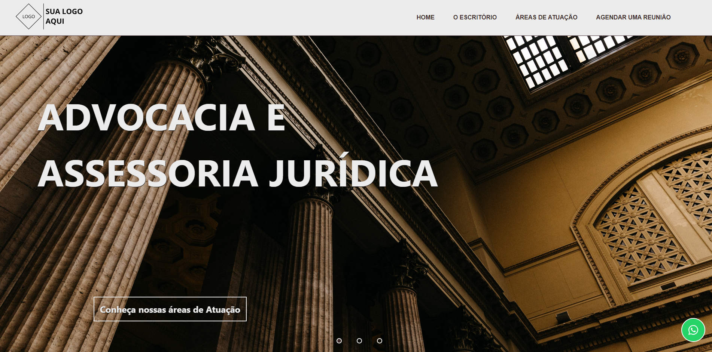
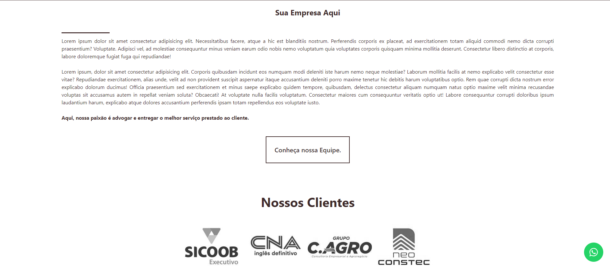
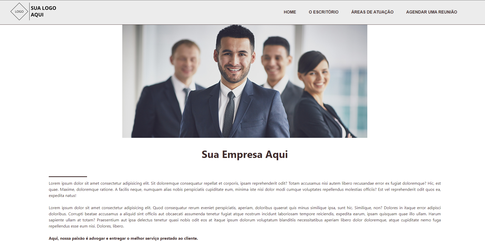
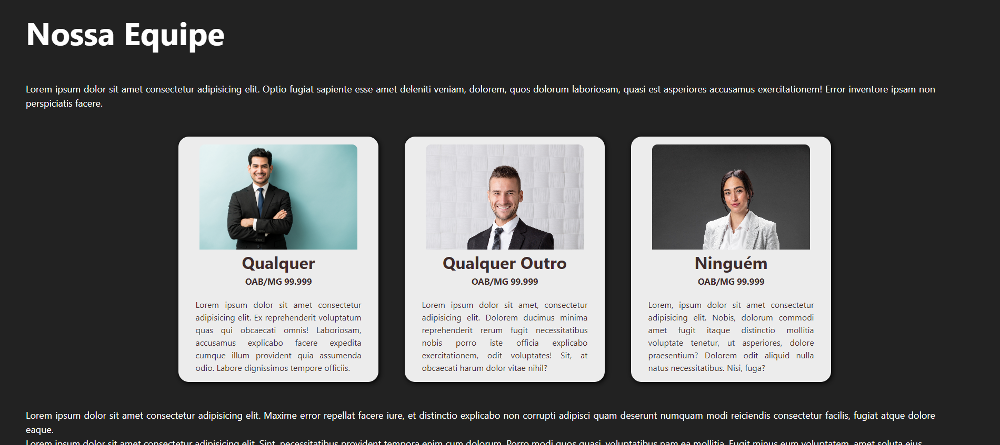
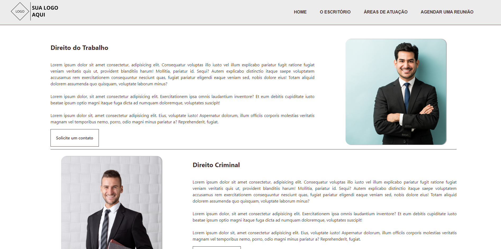

# Lawyer Website

  

  

  

  

  

## Descrição

Modelo de site para uma empresa de acessoria jurídica. Criado com intuito de estudar algumas funcionalidades como o desenvolvimento de um slider sem o uso de nenhuma biblioteca para a funcionalidade dele. Foi usada a arquitetura de Single Page Application para uma maior fluidez após o carregamento das rotas.

## Funcionalidades

1. **Home**: Página inicial;

2. **O Escritório**: Informações sobre a empresa, destacando a equipe e seus diferenciais;

3. **Áreas de Atuação**: Rota responsável por apresentar as áreas de atuação da empresa, lincando estas áreas com os respectivos funcionários especialistas nela;

4. **Agendar uma Reunião**: Link responsável por levar o usuário para um contato direto com o whatsapp da empresa.

## Ferramentas Utilizadas

1. **ReactJS + Vite.js**: Foi utilizado o ReactJS juntamente com o Vite.js para o desenvolvimento rápido e eficiente da interface do usuário;

2. **Ícones do React-Icons**: Foram incorporados ícones do React-Icons para uma experiência visual agradável e intuitiva.

3. **Aos Library**: Foi usado o aos Library no slider da home do projeto para dar um efeito visual.

---

## Outras imagens ##

## Licença ##

Este projeto está sob a licença do MIT. Para mais detalhes, veja o arquivo [LICENSE](LICENSE.md).

Desenvolvido por <a href="https://github.com/Striffer" target="_blank">Pedro Lima</a>

&#xa0;

<a href="#top">Voltar ao topo</a>